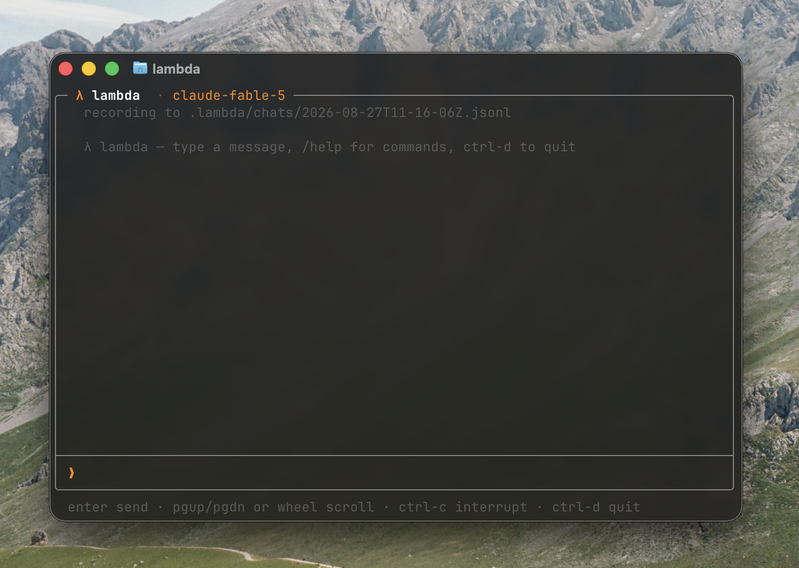

# λ lambda

extremely fast portable agent harness in c.



* fixed-frame tui, scrolls internally, markdown incl. tables
* portable and statically linked
* minimal dynamic memory allocation
* single-file c plugins (exa web search included)
* every chat saved as resumable ndjson

## build

```sh
make            # → ./lambda
make release    # dead-stripped, symbols removed (~251 kb)
make install    # → $(PREFIX)/bin, default /usr/local
make uninstall
make test       # unit tests under asan/ubsan
make uitest     # terminal render + scroll checks (needs python + pyte)
make STATIC=1   # static binary (best with musl-gcc)
make DEBUG=1    # asan/ubsan
```

c99 compiler and gnu make. nothing else.

`install` honours `PREFIX`, `BINDIR`, `DESTDIR`.

## use

```sh
export ANTHROPIC_API_KEY=sk-ant-...

lambda                      # tui
lambda -p "explain memfd"   # one-shot
echo "prompt" | lambda      # one-shot from stdin
lambda resume               # continue the last chat
lambda resume FILE          # continue a specific one
```

| flag | |
|---|---|
| `-m MODEL` | model id (default `claude-fable-5`) |
| `-s SYSTEM` | system prompt |
| `-p PROMPT` | one-shot, then exit |
| `-e EFFORT` | `low`…`max` reasoning effort |
| `-r FILE` / `-c` | same as `resume FILE` / `resume` |
| `--no-thinking` | hide reasoning |
| `--no-tools` | disable bash |
| `--no-log` | don't record |
| `--no-context` | ignore `AGENTS.md` / `CLAUDE.md` |
| `--no-fallback` | disable refusal fallbacks |

commands: `/model`, `/system`, `/effort`, `/thinking`, `/tools`, `/clear`,
`/help`, `/quit`.

bare `/model` opens a picker over the transcript — up/down or `1`-`9` to move,
enter to switch, esc to cancel. `/model ID` sets any id directly, whether or
not it is on the list.

keys: enter sends. pgup/pgdn or wheel scroll. ctrl-c interrupts a reply or a
running command. ctrl-d quits. ctrl-a/e/k/u/w edit, up/down for history.

the input stays live while the model works — enter queues instead of
interrupting. queued prompts show above the input marked `»` and run in order.

piped or redirected it drops the tui and streams plain text to stdout.
`NO_COLOR` disables styling there.

## model

default is claude fable 5, with `display: "summarized"` so reasoning streams
live in dim italic under a `✻` gutter. `--no-thinking` hides it.

`-e` sets `output_config.effort`. unset means the api default; `xhigh` for
long agentic work, `low` for cheap turns.

fable costs ~2x the opus tier ($10/$50 vs $5/$25 per mtok) and needs 30-day
data retention — not available under zdr. `-m claude-opus-5` switches back.
thinking/effort params are only sent to models that accept them, so older ids
like `claude-haiku-4-5` still work.

`/model` lists these, with context window and price per mtok:

| id | ctx | in/out per mtok |
|---|---:|---|
| `claude-fable-5` | 1m | $10/$50, no zdr |
| `claude-opus-5` | 1m | $5/$25 |
| `claude-opus-4-8` | 1m | $5/$25 |
| `claude-sonnet-5` | 1m | $3/$15 |
| `claude-haiku-4-5` | 200k | $1/$5, no thinking |

switching mid-chat keeps the history: thinking blocks replay to the model
that produced them and are dropped by the others.

refusal fallbacks are on by default for fable/opus-5: if a classifier
declines, the api retries on a fallback model in the same call and the status
line notes the switch. `--no-fallback` disables.

## markdown

headings, `**bold**`, `*italic*`, `` `code` ``, fenced blocks, bullets and
quotes are styled a line at a time as the reply streams.

tables are the exception: column widths depend on every row, so a whole
github-style table is laid out once the delimiter row arrives, then drawn
with box rules.

```
| model | ctx | price |
|---|:--:|------:|
| claude-opus-5 | 1m | $5/$25 |
```

alignment colons are honoured, cells wrap when they must, and the widest
column is shaved first to fit the frame. too narrow to draw at all and the
source text is shown instead.

## context files

walks from cwd up to `/` collecting `AGENTS.md` and `CLAUDE.md`, and puts them
at the head of the system prompt with a `cache_control` breakpoint. nearest
file wins. loaded paths print on the first line.

## transcripts

`./.lambda/chats/<timestamp>.jsonl`, one json object per line, written as the
chat happens:

```
{"t":"session","v":1,"time":"…","model":"claude-fable-5","cwd":"…"}
{"t":"msg","m":{"role":"user","content":"…"}}
{"t":"drop","n":1}
{"t":"meta","k":"model","v":"claude-opus-5"}
```

`msg` holds the api message verbatim — text, thinking blocks with signatures,
`tool_use`, `tool_result` — so a resume is byte-identical to what the model
saw. a failed or interrupted turn rolls back and writes `drop`, so resume
never replays a turn that didn't happen.

writes are queued in memory and flushed only when idle, so they never block
the ui or a request. survives `kill -9`.

## bash tool

runs `/bin/sh -c` in its own process group from the cwd. stdout+stderr merged,
truncated at 64 kb, non-zero exit reported to the model. no state persists
between calls. ctrl-c signals the whole group.

**no approval prompt** — if claude decides to run something, it runs. don't
point it at a directory you'd mind it changing. `--no-tools` disables.

## plugins

one `.c` file in `plugins/`. the makefile globs the dir and each file
registers itself at startup — no registry, no codegen.

```c
#include "plugin.h"

static int run(const char *args_json, buf *out)
{
    buf_appends(out, "pong");
    return 0;
}

static const lambda_tool ping = {
    .name = "ping",
    .description = "reply with pong",
    .schema = "{\"type\":\"object\",\"properties\":{}}",
    .run = run,
};

LAMBDA_TOOL_REGISTER(ping)
```

`run` gets the raw input json (parse with `jsonx.h`) and writes the result
into `out`. optional: `available()` hides the tool when e.g. a key is missing,
`label()` sets the transcript line. `plugin_https_post()` reuses lambda's tls.

### exa

`plugins/exa.c` adds `exa_search`. set `EXA_API_KEY` to enable; without it the
tool isn't offered. returns highlights by default (cheap in tokens);
`full_text` for whole pages. `num_results` 1–25, plus `type` and `category`.

## no malloc

every buffer is a static arena sized in `src/config.h`. buffers report
truncation instead of growing; on overflow the turn rolls back and says so.
jsmn, picohttpparser and bearssl are allocation-free too.

measured, not assumed: under an `LD_PRELOAD` interposer, a full session
attributes zero allocations to lambda. the ~500 the process makes are glibc's,
from `getaddrinfo` and stdio. `objdump -R` shows no allocator import.

bss is ~22 mb of arenas but demand-paged, so startup stays ~1 ms.

## tls

bearssl has no os trust store, so root cas load from the first of:
`$SSL_CERT_FILE`, `/etc/ssl/certs/ca-certificates.crt`,
`/etc/pki/tls/certs/ca-bundle.crt`, `/etc/ssl/ca-bundle.pem`,
`/etc/ssl/cert.pem`. parsed lazily on first request.

## layout

```
src/
  main.c    args, repl, slash commands
  api.c     messages api, sse parsing, tool loop
  http.c    https client on bearssl + picohttpparser
  ta.c      pem bundle → bearssl trust anchors
  tools.c   bash tool + dispatch
  plugin.c  plugin registry, shared https helper
  project.c AGENTS.md / CLAUDE.md discovery
  session.c ndjson transcripts, resume
  ui.c      transcript, wrapping, layout, line editor
  term.c    raw mode, alt screen, diffed cells, key decoding
  md.c      inline markdown → style flags
  jsonx.c   jsmn helpers
  util.c    fixed-capacity buffers
  config.h  all arena sizes
plugins/exa.c
vendor/     bearssl 0.6, jsmn, picohttpparser (all MIT)
```

the cell grid tracks display width, not codepoints — cjk and emoji take two
columns, so a wide glyph claims a continuation cell. without it the grid and
terminal disagree and stale glyphs linger when scrolling.

no termbox/curses: lambda uses ~5% of either, and termbox2 keeps pointers into
arrays it reallocs. raw mode + diffed grid + key decoding is ~450 lines.

## tests

`make test` builds `tests/` under asan and ubsan with a deliberately tiny
transcript arena, so compaction and eviction are exercised in a short run
rather than only after hours of use.

`make uitest` covers the two display bugs that have actually shipped. it
replays term.c's own escape output through an independent terminal emulator
and checks the result matches term.c's back buffer — drift there is what
leaves stale glyphs, usually via wide characters. it then fires bursts of
scroll events faster than the repaint coalescing window and checks the
settled screen equals a forced full repaint, which catches a deferred frame
being stranded. `LAMBDA_SELFTEST_FILL=n` seeds the transcript so this runs
with no api key.

ci compiles with `-Werror` on gcc and clang across linux and macos, runs both
suites, and checks the static link.

## limits

* width is per codepoint, so grapheme clusters (flag emoji, skin tones) sit a
  column off
* fresh dns/tcp/tls per turn (`Connection: close`) — a few hundred ms before
  the first token; keep-alive would fix it
* glibc static builds still dlopen nss for dns; use musl for a truly
  self-contained binary
